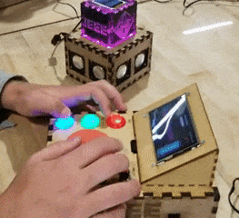
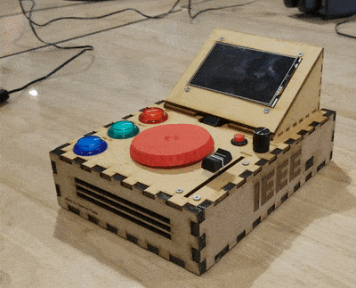
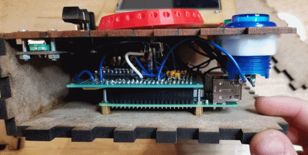
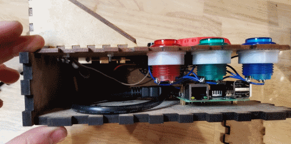
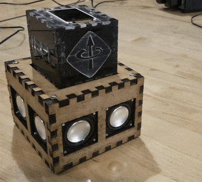
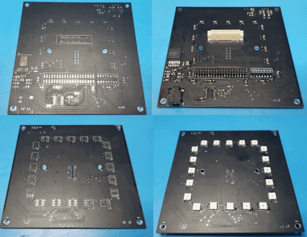
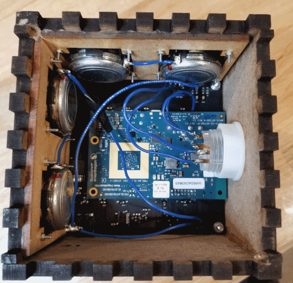

# Bluetooth Retro DJ

This is a IEEE project designed to grab all the attention at every table event. Using the power of ECE majors we contructed the ultimate Retro DJ set that communicates between bluetooth.

## How It All Works!

For details on this, check out either the [Medium Article]() on it or feel free to glance around the code.

## MIDI Controller Box

## LED Speaker

