# LED Speaker Schematics*ish*

> "Sorry Max, I should have learned how to use Altium" ~ Spencer 2018

**Table of Contents**

- [PCB](#pcb)
  - [Basic Layout Concept](#basic-layout-concept)
  - [Dragonboard](#dragonboard)
  - [Power](#power)
  - [Standoff Holes](#standoff-holes)
- [Dragonboard GPIO](#dragonboard-gpio)
- [APA102 LEDS](#apa102-leds)
  - [Layout](#layout)
  - [Pins](#pins)
- [LCD Screen](#lcd-screen)
  - [Pins needed](#pins-needed)
- [Rotary Encoder and Button](#rotary-encoder-and-button)
- [Speakers](#speakers)

# PCB

**Dimensions:** 100mm x 100mm

[Blender File](https://github.com/uwmadisonieee/Bluetooth-Retro-DJ/raw/master/3D_Models/LED_Speaker/LED_Speaker.blend)

## Basic Layout Concept
- 20 LEDs
- Standoffs for inside and out for structural support
- 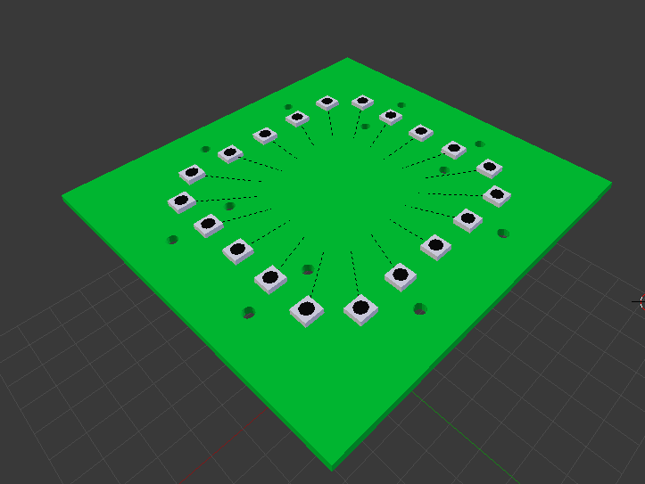

## Dragonboard
- Attached from under via Low and High speed connectors (same as Truman)
- 
- 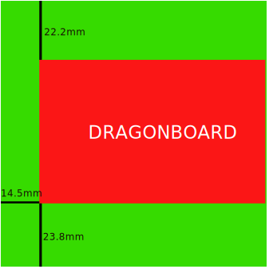
- 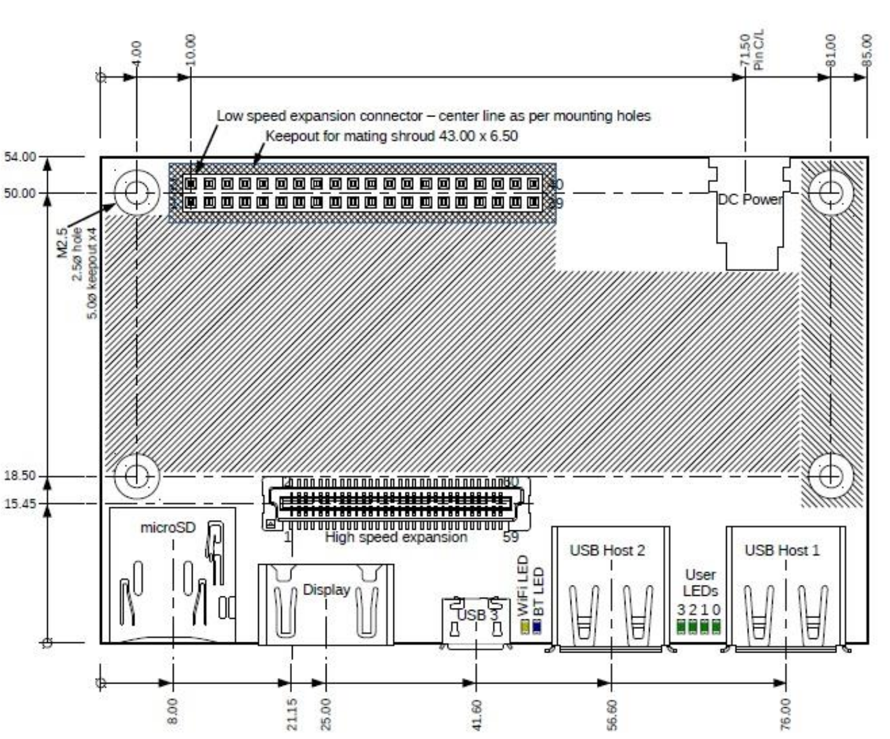
	
## Power

- Barrel Jack on edge of PCB
	- On bottom side
	- Which side is not a concern
- EIAJ3 plug which has 4.75mm diameter with 1.7mm inner diameter
- 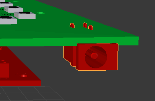

## Standoff Holes
- All Standoff holes are M3 so 3mm diameter holes
- I need to mount the PCB to the base wood box with the outer holes
	- These honestly can be **anywhere**, the closer to the edge would be best for structural support I think
- The inner standoffs are going to be mounted to a pole mounted to top cube
	- These need to be a little more aimed because there is a LED screen on top
	- There is a **12.325mm x 58.65mm** box on each side for two standoff holes
- 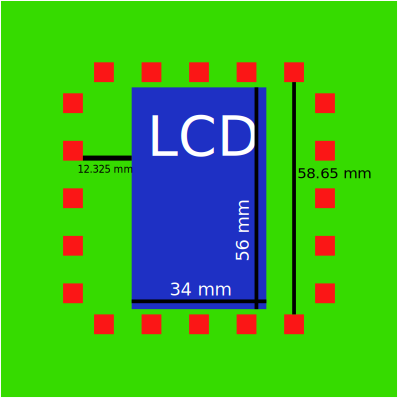

# Dragonboard GPIO
- [Hardware Docs](https://github.com/96boards/documentation/tree/master/consumer/dragonboard410c/hardware-docs)
- 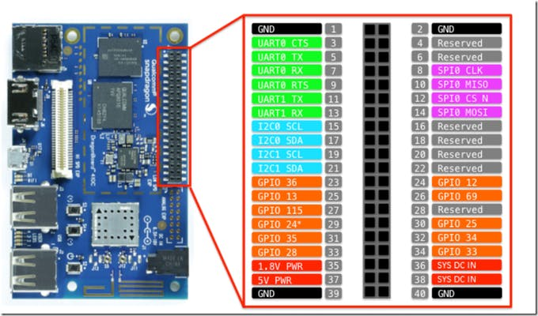
- **PIN 8** - SPI Clk for LED and LCD
- **PIN 14** - SPI MOSI for LED and LCD
- **PIN 24** - SPI Clock Select pin to control Mux for LED and LCD
- **PIN 26** - Reset Pin for LCD 
- **PIN 30** - Data/Control pin for LCD
- **PIN 32** - Rotary Encoder A
- **PIN 34** - Rotary Encoder B
- **PIN 33** - Push Button

# APA102 LEDS
- [Datasheet](https://cdn.sparkfun.com/datasheets/Components/LED/APA102C.pdf)
- 5mm x 5mm x 1.4mm 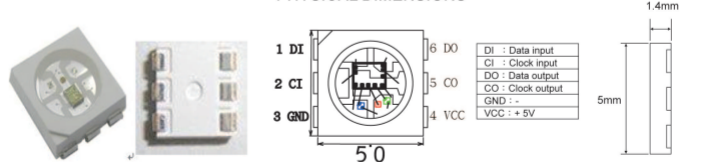
	- [8 long example datasheet](https://cdn.sparkfun.com/assets/d/e/9/0/e/Lumenati_8-stick.pdf) 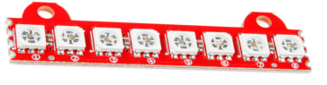
		- [Eagle Files](https://github.com/sparkfun/Lumenati_8-Stick/tree/master/Hardware)
	- [1 meter strip example datasheet](https://cdn.sparkfun.com/datasheets/Components/LED/S60102.pdf) 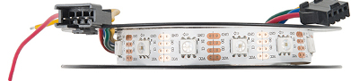

- 20 LEDs on PCB all in series
- Draws ~1.92A at full white light

## Layout
- 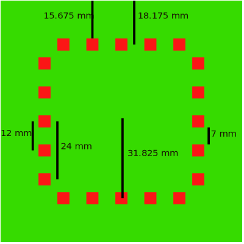
- All LEDs in each strip are 31.825mm from center in X or Y direction
- All LEDs are 18.175mm from edge
- Each LED is 12mm apart from center to center
	- This starts with the middle LED at center in row

## Pins
- Each has 6 pins
	- Data In
	- Clock In
	- GND
	- Data Out
	- Clock Out
	- VCC
- **VCC and GND**
	- This is ran on a 5V rail from main power source because LEDs current draw too much for Dragonboard
- **Data In**
	- The first LED in series is sent data from **PIN 14** of Dragonboard **stepped up to 5V**
- **Clock In**
	- The first LED in series is sent clock from **PIN 8** of Dragonboard **stepped up to 5V**	
- **Clock Select**
	- The first LED in series is clock select via a mux on PCB from **PIN 24** of Dragonboard
	- The APA102 LED only takes SPI feed and has be muxed so SPI can be used in LCD screen as well

# LCD Screen
- 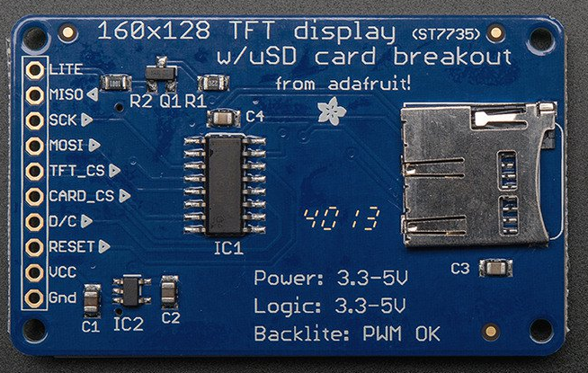
- This screen will be on top of cube so through holes needed to soilder wires
	- **DONT WORRY** Inside of acrylic is going to be painted black so no one will see wires
- All pins **stepped up to 5V**
- Holes must be in inner part of LED ring

## Pins needed
- **LITE and VCC** - This is a 5V power line
- **GND**
- **SCK** --- **PIN 8** of Dragonboard for SPI CLK
- **MOSI** --- **PIN 14** of Dragonboard for SPI MOSI
- **RESET** --- **PIN 28** of Dragonboard
- **D/C** (Data/Control) --- **PIN 30** of Dragonboard
- **TFT_CS** --- **PIN 24** of Dragonboard is used to toggle between LED and LCD screen, this is the pin to toggle for LCD Screen

# Rotary Encoder and Button
- I am going to have these coming out from a side of speaker box
- Need through hole of **PIN 32**, **PIN 33**, and **PIN 34** for controlling these
- Not same side as power barell jack
- Holes will need to be accessed from bottom so best to use edge where Dragonboard isn't sticking out

# Speakers
- We **only need the 2** pins on the edge nearest to the 40 pin set (pin 1 and 2)
	- I will need 2 through hole pins to wire up the Speakers underneath
	- Same idea as Encoder and Button where to put near on a side where Dragonboard isn't sticking out
- [Datasheet for Dragonboard Audio](https://developer.qualcomm.com/qfile/29468/lm80-p0436-43_stereocontaudioroutappnote.pdf)
- What the Audio Mezz does
	- 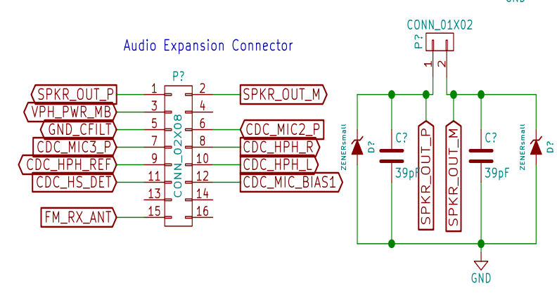
- 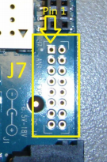
- 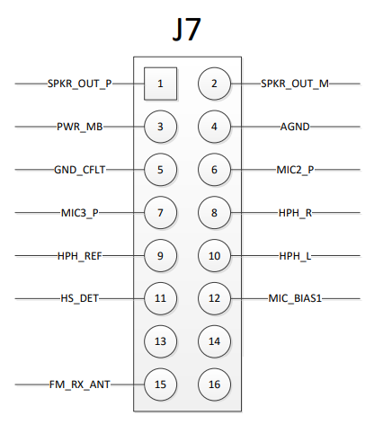
